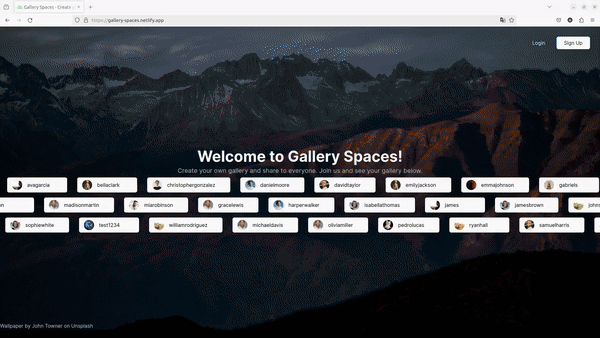

<p align="center">
  
</p>

# Gallery Spaces

Gallery Spaces is a full-stack application that empowers users to create their own galleries, manage them (uploading and deleting images), share their work with others, and customize images before downloading.

Its creation was motivated by participation in a dev.to challenge.

[Demo link](https://gallery-spaces.netlify.app)

### Some application features

- Authentication system (with bcrypt and JWT token)
- Persistent data storage (Netlify Blobs)
- Back-end API, with authentication, image uploader, gallery creator, image provider, etc
- Powerful Image Customization with Netlify Image CDN

## Table of Contents

- [How to Install](#how-to-install)
- [Environment Variables](#environment-variables)
- [Technologies and Tools](#technologies-and-tools)

## How to Install

1. Start by cloning this repository:

```bash
git clone git@github.com:gabrielsenadev/audioinsight.git
```

2. Install dependencies:

```bash
npm ci
```
3. Configure your environment

See [Environment Variables](#environment-variables).

4. Link this repository to a netlify site

```bahs
netlify link
```

5. Start the server
```bash
npm run start
```

## Environment Variables

- NUXT_PASSWORD_SALT = BCrypt salt, example: 10
- NUXT_AUTH_TOKEN_SECRET = Secret to encrypt/verify JWT tokens
- NUXT_STORE_KEY_SEPARATOR = Netlify separator strategy: recomended: production "/", local: ":""
- NUXT_NETLIFY_SITE_ID
- NUXT_NETLIFY_TOKEN

## Technologies and Tools

- Netlify Image CDN
- Netlify Blobs
- Netlify Functions
- Nuxt 3
- Vue 3
- TailwindCSS
- Zod
- Tabler Icons
- JWT
- BCrypt
